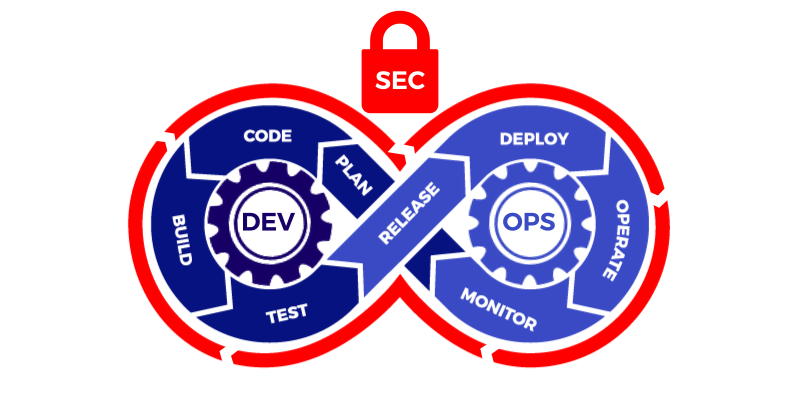

  

# 👋 Hi, I'm Vivekanandha R!

**B.Tech (IT) graduate | Ex-IBM/Kyndryl AS400 System Administrator | Aspiring DevOps Engineer**

---

## 🚀 About Me

I'm A Passionate Techie With Hands-On Experience As An AS400 System Administrator At IBM/Kyndryl, Where I Managed Mission-Critical Internal And Finance-Related Projects Focusing On System Stability, Compliance, Administration and Operations. My Journey Has Given Me A Strong Foundation in Enterprise Infrastructure and Monitoring, And I'm Now Channeling That Expertise Into Devops—Bridging The Gap Between Operations and Automation.

---
## 🛠️ Professional Background

**AS400 System Administrator**  
*IBM / Kyndryl*

- Monitored COB/EOD Processes, Ensuring Timely And Successful Batch Job Executions
- Performed Daily Health Checks On CPU, Memory, Disk Space, and Job Queues
- Applied System Patches, Managed OS Installations, and Conducted Migrations With Minimal Downtime
- Managed System Backups, Verified Recoveries, and Implemented Disaster Recovery Strategies
- Oversaw User Access, Audited Privileges, Maintained Security Compliance
- Documented Configurations, Procedures, and Incident Management
- Collaborated With Cross-Functional Teams to Support Complex Projects
- Managed Incidents and Change Requests Via ServiceNow, Handled System Backups, and Ensured Strict SLA Compliance in Support of IT Operations.

> **Key Takeaway:** Developed Expertise In Managing Mission-Critical Systems, Troubleshooting, And Enterprise IT Operations—Skills & I’m Now Applying In Devops.

---

## 🚀 Transitioning to DevOps

### 🔧 AWS VPC Setup With Terraform
- Designed/Deployed Custom AWS Vpcs Across Multiple Azs Using Terraform
- Configured Secure Networking—Public/Private Subnets, Gateways, Routing, And Security Groups
- Automated EC2 Provisioning And Multi-Tier Communication

### 🛠️ Infrastructure As Code (Iac)
- Automated AWS Resource Provisioning (EC2, IAM, S3, EBS, EKS) With Terraform Modules
- Employed Variables, Outputs, And Remote Backends For Modularity And Reusability
- Simulated Infrastructure Version Control And Continuous Delivery Via Pipeline Integration

### ⚙️ CI/CD Pipeline Automation
- Built Deployment Pipelines With Jenkins (Freestyle And Scripted) And Github Actions (YAML Workflows)
- Automated Build, Test, And Deployment Of Dockerized Applications
- Integrated With AWS EC2 And Docker Hub For Real-World Devops Delivery

---

## 🎯 Current Focus

- Solving Real-World Problems Through Automation
- Writing Efficient, Reusable Terraform Modules
- Automating Deployments And Infrastructure Using Ci/Cd
- Building Monitoring Setups With Cloudwatch & Prometheus
- Deepening Expertise In Aws, Docker, Kubernetes, And Devops Best Practices

---
<h3 align="left">Languages and Tools:</h3>

  
  
  
  
  
  
  
  
  
  
  
  
  
  
  
  

&nbsp;

## 🏆 Top Skills

 

---

## 🌐 Connect With Me

---

## 🧩 Hobbies

- Cricket 🏏
- Badminton 🏸
- Chess ♟️
- Quizzing ❓
- Following the News 📰

---

<!--
**Vivekanandha21/Vivekanandha21** Is A ✨ Special ✨ Repository Because Its README.Md (This File) Appears On Your Github Profile.

Here are some ideas to get you started:

- 🔭 I’m currently working on ...
- 🌱 I’m currently learning ...
- 👯 I’m looking to collaborate on ...
- 🤔 I’m looking for help with ...
- 💬 Ask me about ...
- 📫 How to reach me: ...
- 😄 Pronouns: ...
- ⚡ Fun fact: ...
-->
